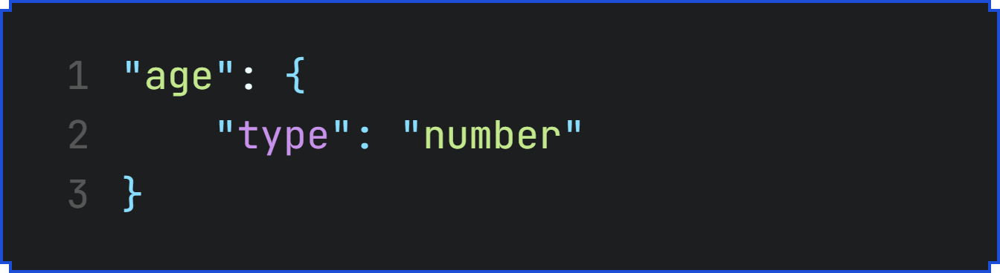
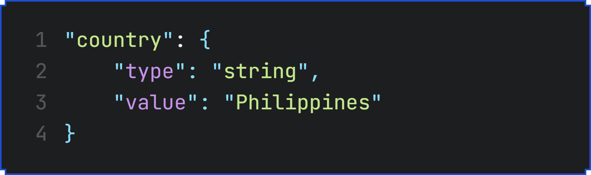
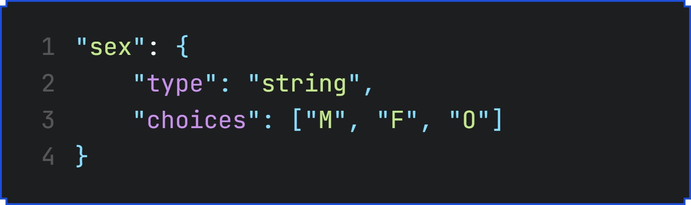
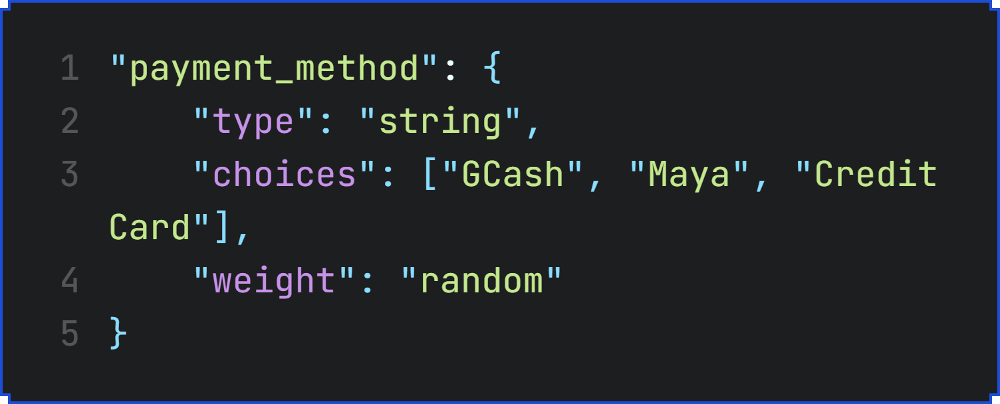

# Schema Guide

The schema is a JSON object that defines the structure and rules for generating synthetic data. Each key in the schema represents a column in the dataset, and its value is a configuration object that specifies how the data for that column should be generated.

| Property Name | Description | Applicable Types | Example (code) | Example (image) | 
| --- | --- | --- | --- | --- |
| `type` | Specifies the data type of the column. | `string`, `number`, `date`, `time`, `boolean` | `"age": { "type": "number" }` |  |
| `value` | Assigns a fixed value to the column. If specified, all other properties are ignored. | All | `"country": { "type": "string", "value": "Philippines" }`|  |
| `choices` | Specifies a list of possible values for the column. A random value is selected from this list. | `string`, `number`, `boolean` | `"sex": { "type": "string", "choices": ["M", "F", "O"] }` |  |
| `weight` | Specifies how random choices are weighted. If set to "random", weights are generated using a Dirichlet distribution. | `string`, `number`, `boolean`    NOTE: (when `choices` is used).` | `"payment_method": { "type": "string", "choices": ["GCash", "Maya", "Credit Card"], "weight": "random" }` |  |